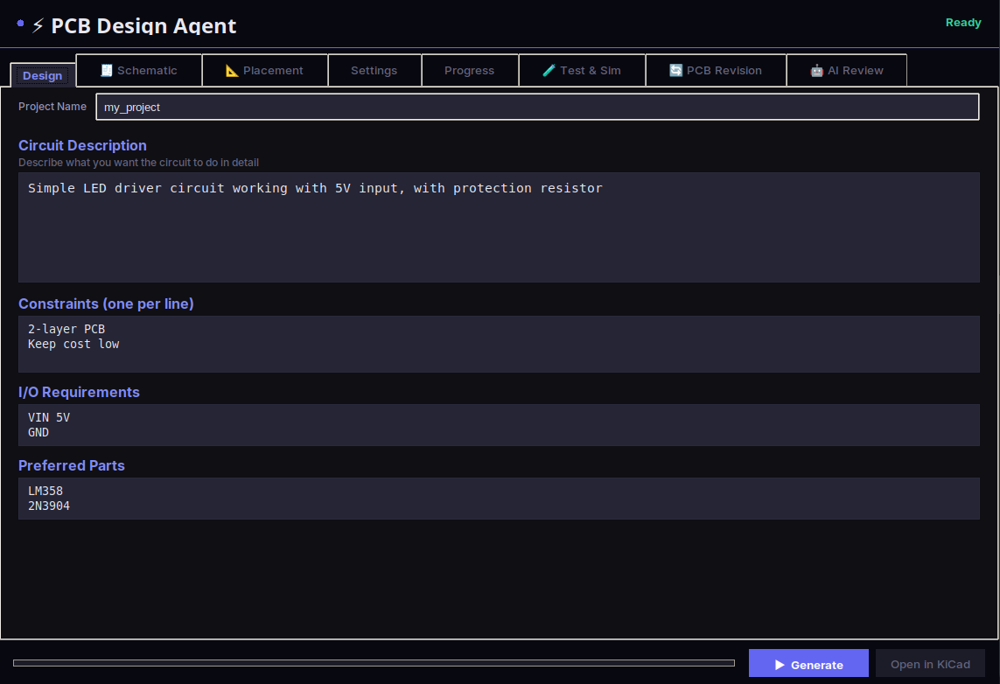
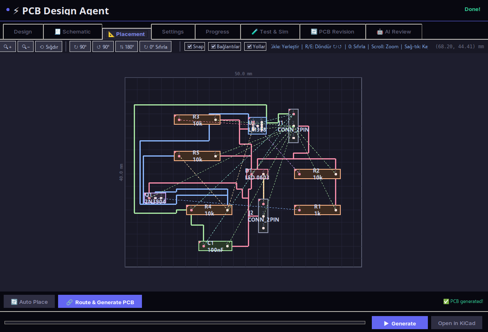
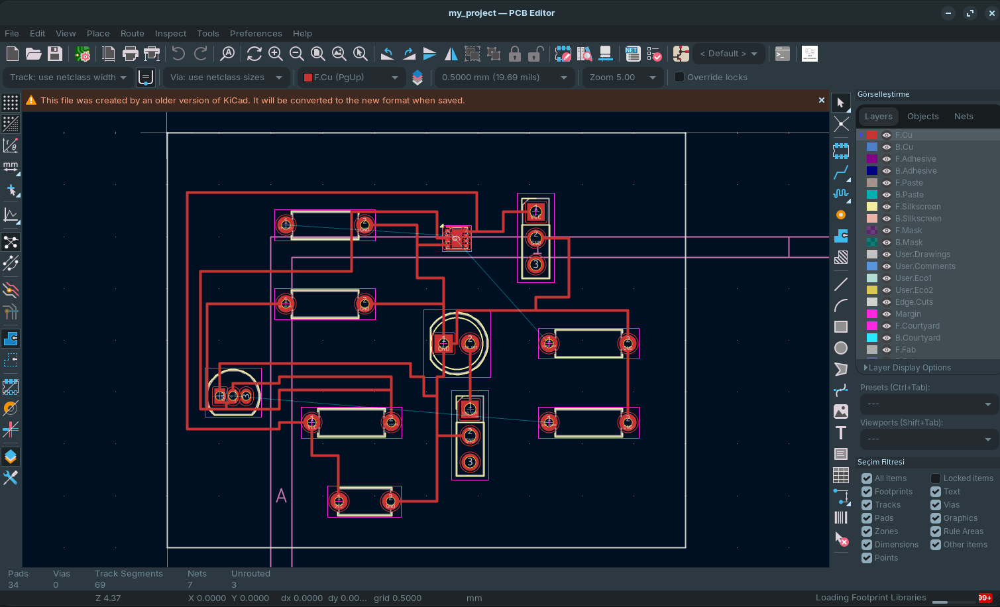
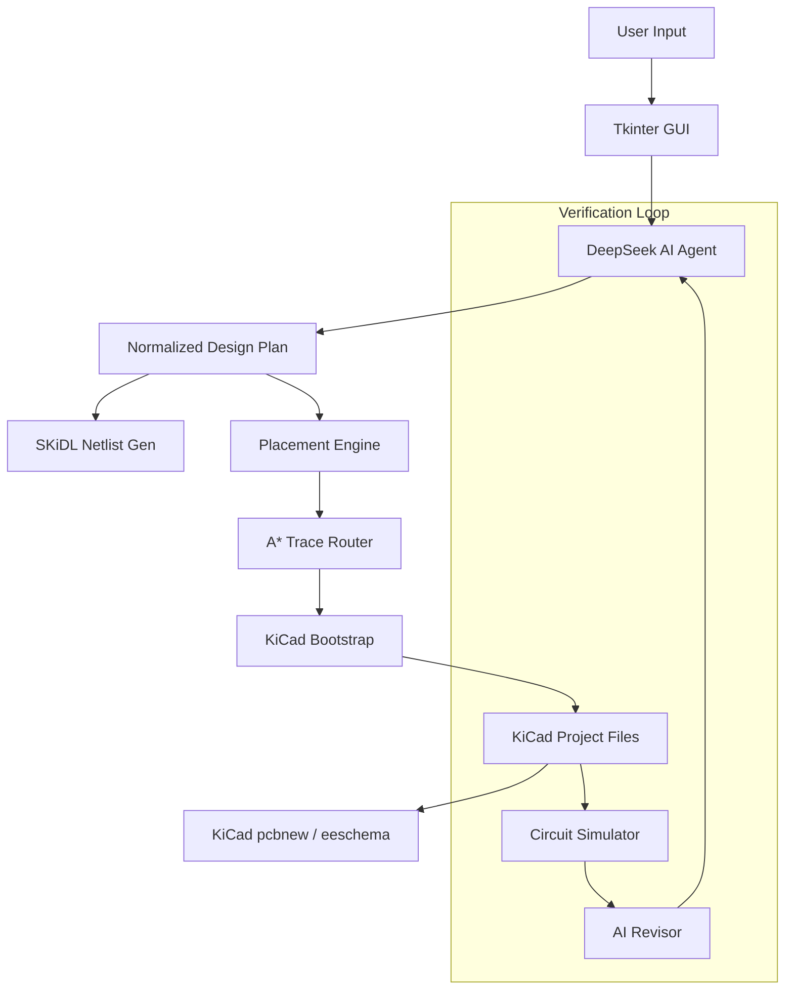

# PCBKo ⚡ — Open Source PCB Designer

Version 0.1

[](https://opensource.org/licenses/MIT)
[](https://github.com/aliemreko/PCBKo)
[](https://www.python.org/downloads/)
[](https://deepseek.com/)

PCBKo is an open source PCB design assistant that transforms natural language requirements into fully generated KiCad-compatible board designs. It combines AI reasoning with routing and layout automation to shorten the hardware prototyping cycle.

---

## 📖 Table of Contents
- [Overview](#-overview)
- [Key Features](#-key-features)
- [Screenshots](#-screenshots)
- [Architecture](#-architecture)
- [Installation & Usage](#-installation--usage)
- [Configuration](#-configuration)
- [Project Structure](#-project-structure)
- [Technical Details](#-technical-details)
- [Roadmap](#-roadmap)
- [Disclaimer](#-disclaimer)
- [License](#-license)

---

## 🌟 Overview
Traditional PCB design is a manual, iterative process. **PCBKo** automates the initial phases of engineering, allowing designers to focus on high-level architecture. Simply describe your requirements (e.g., *"A battery-powered CO2 monitor with an OLED display and USB-C charging"*), and the agent will generate a complete design package including schematics and board layouts.

## ✨ Key Features
- **Natural Language Parsing**: High-level intent extraction into formal engineering specifications.
- **Smart Component Selection**: Automatic mapping of requirements to real-world parts (BOM generation).
- **Intelligent Routing**: Custom A* grid-based routing engine optimized for 2-layer boards.
- **Visual Canvas**: Interactive placement canvas built with Tkinter for manual override and adjustment.
- **Multi-modal AI Review**: Visual design audit using Computer Vision to identify routing bottlenecks or placement issues.
- **Closed-loop Simulation**: Integrated circuit simulation that provides feedback to the AI for iterative design improvements.
- **KiCad Native Support**: Exports project files directly compatible with KiCad 7.0/8.0.

## 🖼️ Screenshots
The screenshots below show the app interface and generated KiCad output.

| Design | Placement | KiCad Output |
| --- | --- | --- |
|  |  |  |

> Note: screenshot files are available in the repository root as `11.png`, `12.png`, and `13.png`.

## 📐 Architecture


## 🚀 Installation & Usage

### Requirements
- **Python 3.10+**
- **KiCad 7.0/8.0**
- **Git**

### Installation
1. **Clone the repository:**
   ```bash
git clone https://github.com/aliemreko/PCBKo.git
cd PCBKo
```

2. **Install dependencies:**
   ```bash
./install.sh
```

3. **Optional install modes:**
   - Install to user site:
     ```bash
./install.sh --user
```
   - Create and use a virtual environment:
     ```bash
./install.sh --venv
```

4. **Configure environment variables:**
   ```bash
cp .env.example .env
```
   Then add your `DEEPSEEK_API_KEY` to `.env`.

### Run the application
```bash
./start.sh
```

> If `PySide6` fails to install, `start.sh` will automatically fall back to the Tkinter interface.

### Quick Start
1. Start the UI with `./start.sh`.
2. Enter your project name, description, and requirements.
3. Verify board size, trace settings, and output folder in `Settings`.
4. Click `Generate` to build the design, schematic, and PCB outputs.
5. When finished, use `Open in KiCad` to inspect the result in KiCad.

## ⚙️ Configuration
You can configure the following `.env` variables:
| Variable | Description | Default |
|----------|-------------|---------|
| `DEEPSEEK_API_KEY` | Your DeepSeek Platform Key | Required |
| `DEEPSEEK_MODEL` | AI model for design logic | `deepseek-v3.2` |
| `UI_LANG` | Interface language (`en` or `tr`) | `en` |
| `VISION_API_KEY` | Key for visual review features | Optional |

## 📂 Project Structure
```text
.
├── src/
│   ├── gui.py               # Main Tkinter interface
│   ├── deepseek_agent.py    # LLM interaction logic
│   ├── layout_router.py     # A* Routing engine
│   ├── placement_canvas.py  # Interactive canvas widget
│   ├── circuit_simulator.py # Verification & Simulation
│   ├── pcb_revisor.py       # Iterative improvement logic
│   └── i18n.py              # Internationalization support
├── examples/                # Sample design specifications
├── requirements.txt         # Project dependencies
├── run_gui.py               # Application entry point
└── README.md                # You are here
```

## 🛠️ Technical Details
- **Routing**: The agent uses a custom grid-based A* algorithm to find optimal paths for nets, considering trace clearance and width constraints.
- **Persistence**: Project metadata and generated artifacts are stored in the `output/` directory (git-ignored).
- **Communication**: Uses the OpenAI-compatible SDK to interact with DeepSeek's high-reasoning models.

## 🗺️ Roadmap
- [ ] Support for 4+ layer boards.
- [ ] Integration with Octopart API for real-time BOM pricing.
- [ ] Plugin architecture for KiCad.
- [ ] Support for high-speed differential pairs.

## ⚠️ Disclaimer
This tool is intended for rapid prototyping and educational purposes. Always perform manual design rule checks (DRC) and electrical rule checks (ERC) in KiCad before ordering physical boards.

## 📄 License

This project is licensed under the **MIT License**.

- **Attribution is required**: You must give appropriate credit and provide a link to the license.
- **Freedom to use**: You can use, modify, and distribute the software for any purpose, including commercial projects.

See the [LICENSE](LICENSE) file for the full text.
